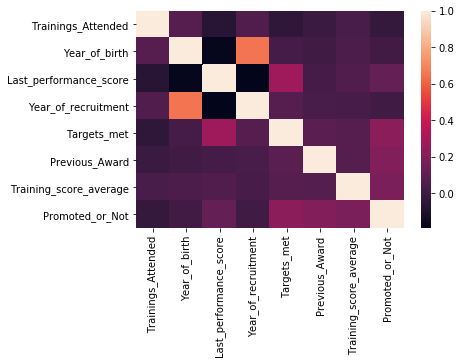
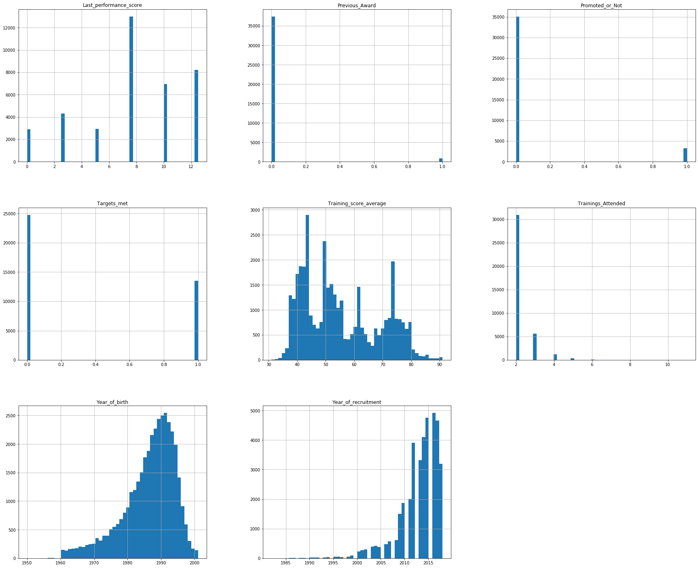
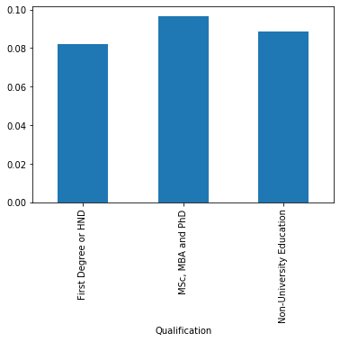
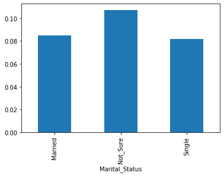
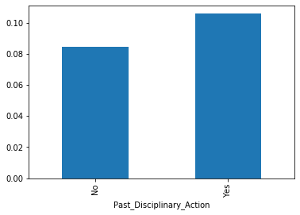

```python
import pandas as pd
import numpy as np
import matplotlib.pyplot as plt
import seaborn as sns
from sklearn.model_selection import train_test_split
from sklearn.preprocessing import LabelBinarizer,StandardScaler,LabelEncoder
from sklearn.model_selection import train_test_split
from sklearn.model_selection import GridSearchCV,RandomizedSearchCV
from sklearn.ensemble import VotingClassifier
%matplotlib inline
```

## Reading in the dataset


```python
# read in the dataset and preview it
full_dataset=pd.read_csv("train.csv")
full_dataset.head()
```


<div>
<style scoped>
    .dataframe tbody tr th:only-of-type {
        vertical-align: middle;
    }

    .dataframe tbody tr th {
        vertical-align: top;
    }

    .dataframe thead th {
        text-align: right;
    }
</style>
<table border="1" class="dataframe">
  <thead>
    <tr style="text-align: right;">
      <th></th>
      <th>EmployeeNo</th>
      <th>Division</th>
      <th>Qualification</th>
      <th>Gender</th>
      <th>Channel_of_Recruitment</th>
      <th>Trainings_Attended</th>
      <th>Year_of_birth</th>
      <th>Last_performance_score</th>
      <th>Year_of_recruitment</th>
      <th>Targets_met</th>
      <th>Previous_Award</th>
      <th>Training_score_average</th>
      <th>State_Of_Origin</th>
      <th>Foreign_schooled</th>
      <th>Marital_Status</th>
      <th>Past_Disciplinary_Action</th>
      <th>Previous_IntraDepartmental_Movement</th>
      <th>No_of_previous_employers</th>
      <th>Promoted_or_Not</th>
    </tr>
  </thead>
  <tbody>
    <tr>
      <th>0</th>
      <td>YAK/S/00001</td>
      <td>Commercial Sales and Marketing</td>
      <td>MSc, MBA and PhD</td>
      <td>Female</td>
      <td>Direct Internal process</td>
      <td>2</td>
      <td>1986</td>
      <td>12.5</td>
      <td>2011</td>
      <td>1</td>
      <td>0</td>
      <td>41</td>
      <td>ANAMBRA</td>
      <td>No</td>
      <td>Married</td>
      <td>No</td>
      <td>No</td>
      <td>0</td>
      <td>0</td>
    </tr>
    <tr>
      <th>1</th>
      <td>YAK/S/00002</td>
      <td>Customer Support and Field Operations</td>
      <td>First Degree or HND</td>
      <td>Male</td>
      <td>Agency and others</td>
      <td>2</td>
      <td>1991</td>
      <td>12.5</td>
      <td>2015</td>
      <td>0</td>
      <td>0</td>
      <td>52</td>
      <td>ANAMBRA</td>
      <td>Yes</td>
      <td>Married</td>
      <td>No</td>
      <td>No</td>
      <td>0</td>
      <td>0</td>
    </tr>
    <tr>
      <th>2</th>
      <td>YAK/S/00003</td>
      <td>Commercial Sales and Marketing</td>
      <td>First Degree or HND</td>
      <td>Male</td>
      <td>Direct Internal process</td>
      <td>2</td>
      <td>1987</td>
      <td>7.5</td>
      <td>2012</td>
      <td>0</td>
      <td>0</td>
      <td>42</td>
      <td>KATSINA</td>
      <td>Yes</td>
      <td>Married</td>
      <td>No</td>
      <td>No</td>
      <td>0</td>
      <td>0</td>
    </tr>
    <tr>
      <th>3</th>
      <td>YAK/S/00004</td>
      <td>Commercial Sales and Marketing</td>
      <td>First Degree or HND</td>
      <td>Male</td>
      <td>Agency and others</td>
      <td>3</td>
      <td>1982</td>
      <td>2.5</td>
      <td>2009</td>
      <td>0</td>
      <td>0</td>
      <td>42</td>
      <td>NIGER</td>
      <td>Yes</td>
      <td>Single</td>
      <td>No</td>
      <td>No</td>
      <td>1</td>
      <td>0</td>
    </tr>
    <tr>
      <th>4</th>
      <td>YAK/S/00006</td>
      <td>Information and Strategy</td>
      <td>First Degree or HND</td>
      <td>Male</td>
      <td>Direct Internal process</td>
      <td>3</td>
      <td>1990</td>
      <td>7.5</td>
      <td>2012</td>
      <td>0</td>
      <td>0</td>
      <td>77</td>
      <td>AKWA IBOM</td>
      <td>Yes</td>
      <td>Married</td>
      <td>No</td>
      <td>No</td>
      <td>1</td>
      <td>0</td>
    </tr>
  </tbody>
</table>
</div>


```python

```

## Slight Exploratory Data Analysis of the data to know what we are working with Plus comments


```python
# get a general feel of the data
full_dataset.info()
# note that the 'qualification' has some missing data
```

    <class 'pandas.core.frame.DataFrame'>
    RangeIndex: 38312 entries, 0 to 38311
    Data columns (total 19 columns):
    EmployeeNo                             38312 non-null object
    Division                               38312 non-null object
    Qualification                          36633 non-null object
    Gender                                 38312 non-null object
    Channel_of_Recruitment                 38312 non-null object
    Trainings_Attended                     38312 non-null int64
    Year_of_birth                          38312 non-null int64
    Last_performance_score                 38312 non-null float64
    Year_of_recruitment                    38312 non-null int64
    Targets_met                            38312 non-null int64
    Previous_Award                         38312 non-null int64
    Training_score_average                 38312 non-null int64
    State_Of_Origin                        38312 non-null object
    Foreign_schooled                       38312 non-null object
    Marital_Status                         38312 non-null object
    Past_Disciplinary_Action               38312 non-null object
    Previous_IntraDepartmental_Movement    38312 non-null object
    No_of_previous_employers               38312 non-null object
    Promoted_or_Not                        38312 non-null int64
    dtypes: float64(1), int64(7), object(11)
    memory usage: 5.6+ MB
    


```python
# visualise some featues that are highly correlated with each other, on the numerical variables
sns.heatmap(full_dataset.corr())
```


    <matplotlib.axes._subplots.AxesSubplot at 0x27761a31a90>





```python
# visualise the buckets to see the distribution of the numerical data
full_dataset.hist(bins=50,figsize=(30,25))
# side-note convert the ages to respective buckets, there is an outlier that is older than 1960
```


    array([[<matplotlib.axes._subplots.AxesSubplot object at 0x0000027761DBF8D0>,
            <matplotlib.axes._subplots.AxesSubplot object at 0x0000027761E08B00>,
            <matplotlib.axes._subplots.AxesSubplot object at 0x0000027761E450B8>],
           [<matplotlib.axes._subplots.AxesSubplot object at 0x0000027761E75668>,
            <matplotlib.axes._subplots.AxesSubplot object at 0x0000027761EA8C18>,
            <matplotlib.axes._subplots.AxesSubplot object at 0x0000027761EE7208>],
           [<matplotlib.axes._subplots.AxesSubplot object at 0x0000027761F177B8>,
            <matplotlib.axes._subplots.AxesSubplot object at 0x0000027761F48DA0>,
            <matplotlib.axes._subplots.AxesSubplot object at 0x0000027761F48DD8>]],
          dtype=object)





```python
# get a top-bottom statistical insight into the entire dataset
full_dataset.describe().T
```


<div>
<style scoped>
    .dataframe tbody tr th:only-of-type {
        vertical-align: middle;
    }

    .dataframe tbody tr th {
        vertical-align: top;
    }

    .dataframe thead th {
        text-align: right;
    }
</style>
<table border="1" class="dataframe">
  <thead>
    <tr style="text-align: right;">
      <th></th>
      <th>count</th>
      <th>mean</th>
      <th>std</th>
      <th>min</th>
      <th>25%</th>
      <th>50%</th>
      <th>75%</th>
      <th>max</th>
    </tr>
  </thead>
  <tbody>
    <tr>
      <th>Trainings_Attended</th>
      <td>38312.0</td>
      <td>2.253680</td>
      <td>0.609443</td>
      <td>2.0</td>
      <td>2.0</td>
      <td>2.0</td>
      <td>2.0</td>
      <td>11.0</td>
    </tr>
    <tr>
      <th>Year_of_birth</th>
      <td>38312.0</td>
      <td>1986.209334</td>
      <td>7.646047</td>
      <td>1950.0</td>
      <td>1982.0</td>
      <td>1988.0</td>
      <td>1992.0</td>
      <td>2001.0</td>
    </tr>
    <tr>
      <th>Last_performance_score</th>
      <td>38312.0</td>
      <td>7.698959</td>
      <td>3.744135</td>
      <td>0.0</td>
      <td>5.0</td>
      <td>7.5</td>
      <td>10.0</td>
      <td>12.5</td>
    </tr>
    <tr>
      <th>Year_of_recruitment</th>
      <td>38312.0</td>
      <td>2013.139695</td>
      <td>4.261451</td>
      <td>1982.0</td>
      <td>2012.0</td>
      <td>2014.0</td>
      <td>2016.0</td>
      <td>2018.0</td>
    </tr>
    <tr>
      <th>Targets_met</th>
      <td>38312.0</td>
      <td>0.352996</td>
      <td>0.477908</td>
      <td>0.0</td>
      <td>0.0</td>
      <td>0.0</td>
      <td>1.0</td>
      <td>1.0</td>
    </tr>
    <tr>
      <th>Previous_Award</th>
      <td>38312.0</td>
      <td>0.023152</td>
      <td>0.150388</td>
      <td>0.0</td>
      <td>0.0</td>
      <td>0.0</td>
      <td>0.0</td>
      <td>1.0</td>
    </tr>
    <tr>
      <th>Training_score_average</th>
      <td>38312.0</td>
      <td>55.366465</td>
      <td>13.362741</td>
      <td>31.0</td>
      <td>43.0</td>
      <td>52.0</td>
      <td>68.0</td>
      <td>91.0</td>
    </tr>
    <tr>
      <th>Promoted_or_Not</th>
      <td>38312.0</td>
      <td>0.084595</td>
      <td>0.278282</td>
      <td>0.0</td>
      <td>0.0</td>
      <td>0.0</td>
      <td>0.0</td>
      <td>1.0</td>
    </tr>
  </tbody>
</table>
</div>


```python
# check out the people who were born before 1960, since they are so few(12), we then turn them into category "people < 1960"
# the age is also normally distributed/slightly tail heavy,so there is no need for much transformation.
full_dataset[full_dataset['Year_of_birth']<1960].shape[0]
# min 1950   max 2001
```


    12


```python
full_dataset['No_of_previous_employers'].value_counts()
```


    1              18867
    0              13272
    2               1918
    3               1587
    4               1324
    5                943
    More than 5      401
    Name: No_of_previous_employers, dtype: int64


## Indepth Exploratory data analysis and Sidenotes


```python
full_dataset.head(2)
```


<div>
<style scoped>
    .dataframe tbody tr th:only-of-type {
        vertical-align: middle;
    }

    .dataframe tbody tr th {
        vertical-align: top;
    }

    .dataframe thead th {
        text-align: right;
    }
</style>
<table border="1" class="dataframe">
  <thead>
    <tr style="text-align: right;">
      <th></th>
      <th>EmployeeNo</th>
      <th>Division</th>
      <th>Qualification</th>
      <th>Gender</th>
      <th>Channel_of_Recruitment</th>
      <th>Trainings_Attended</th>
      <th>Year_of_birth</th>
      <th>Last_performance_score</th>
      <th>Year_of_recruitment</th>
      <th>Targets_met</th>
      <th>Previous_Award</th>
      <th>Training_score_average</th>
      <th>State_Of_Origin</th>
      <th>Foreign_schooled</th>
      <th>Marital_Status</th>
      <th>Past_Disciplinary_Action</th>
      <th>Previous_IntraDepartmental_Movement</th>
      <th>No_of_previous_employers</th>
      <th>Promoted_or_Not</th>
    </tr>
  </thead>
  <tbody>
    <tr>
      <th>0</th>
      <td>YAK/S/00001</td>
      <td>Commercial Sales and Marketing</td>
      <td>MSc, MBA and PhD</td>
      <td>Female</td>
      <td>Direct Internal process</td>
      <td>2</td>
      <td>1986</td>
      <td>12.5</td>
      <td>2011</td>
      <td>1</td>
      <td>0</td>
      <td>41</td>
      <td>ANAMBRA</td>
      <td>No</td>
      <td>Married</td>
      <td>No</td>
      <td>No</td>
      <td>0</td>
      <td>0</td>
    </tr>
    <tr>
      <th>1</th>
      <td>YAK/S/00002</td>
      <td>Customer Support and Field Operations</td>
      <td>First Degree or HND</td>
      <td>Male</td>
      <td>Agency and others</td>
      <td>2</td>
      <td>1991</td>
      <td>12.5</td>
      <td>2015</td>
      <td>0</td>
      <td>0</td>
      <td>52</td>
      <td>ANAMBRA</td>
      <td>Yes</td>
      <td>Married</td>
      <td>No</td>
      <td>No</td>
      <td>0</td>
      <td>0</td>
    </tr>
  </tbody>
</table>
</div>


```python
full_dataset['Marital_Status'].value_counts()
# turn any not-sure into Single to prevent our algorithm from learning garbage
```


    Married     31022
    Single       6927
    Not_Sure      363
    Name: Marital_Status, dtype: int64


```python
full_dataset['State_Of_Origin'].value_counts()
# i should probably map state of each state to the three major tribes to know if they are yoruba, igbo or hausa
```


    LAGOS          6204
    FCT            2389
    OGUN           2302
    RIVERS         2222
    ANAMBRA        1710
    KANO           1649
    DELTA          1594
    OYO            1508
    KADUNA         1399
    IMO            1307
    EDO            1259
    ENUGU          1025
    ABIA            950
    OSUN            929
    ONDO            875
    NIGER           857
    KWARA           765
    PLATEAU         739
    AKWA IBOM       673
    NASSARAWA       632
    KATSINA         615
    ADAMAWA         605
    BENUE           579
    BAUCHI          557
    KOGI            542
    SOKOTO          499
    CROSS RIVER     495
    EKITI           455
    BORNO           447
    TARABA          400
    KEBBI           393
    BAYELSA         324
    EBONYI          313
    GOMBE           291
    ZAMFARA         290
    JIGAWA          262
    YOBE            257
    Name: State_Of_Origin, dtype: int64


```python
full_dataset['Trainings_Attended'].value_counts()
# since greater than 5 training is pretty few, i should consider making it anything>5 = 5
```


    2     30981
    3      5631
    4      1244
    5       316
    6        93
    7        28
    8         6
    10        5
    11        4
    9         4
    Name: Trainings_Attended, dtype: int64


```python
full_dataset['Channel_of_Recruitment'].value_counts()
# nothing here too. we just categorically encode them
```


    Agency and others                  21310
    Direct Internal process            16194
    Referral and Special candidates      808
    Name: Channel_of_Recruitment, dtype: int64


```python
full_dataset['Gender'].value_counts()
# genders are fair, i guess. nothing much to see here, we just simply categorically encode it
```


    Male      26880
    Female    11432
    Name: Gender, dtype: int64


```python
full_dataset['Qualification'].value_counts()
# this seems pretty distributed too, but we categorically encode them wrt their level 3,2,1
# fill in missing values with Non-University Education
```


    First Degree or HND         25578
    MSc, MBA and PhD            10469
    Non-University Education      586
    Name: Qualification, dtype: int64


```python
full_dataset['Division'].value_counts()
# pretty well distributed, no further engineering needed, simply categorically encoding them
```


    Commercial Sales and Marketing                 11695
    Customer Support and Field Operations           7973
    Sourcing and Purchasing                         5052
    Information Technology and Solution Support     4952
    Information and Strategy                        3721
    Business Finance Operations                     1786
    People/HR Management                            1704
    Regulatory and Legal services                    733
    Research and Innovation                          696
    Name: Division, dtype: int64


```python
# note that the dataset it gr
full_dataset['Promoted_or_Not'].value_counts()
```


    0    35071
    1     3241
    Name: Promoted_or_Not, dtype: int64


```python

```

## Data Spliting

#### Split into Train,Testing and validation set (60%,25%,15%)


```python
X=full_dataset.drop(['Promoted_or_Not'],1)
y=full_dataset['Promoted_or_Not']
```


```python
# split into train and test/validation
X_train, X_test_valid, y_train, y_test_valid = train_test_split(X, y, test_size=0.4, random_state=42)

# split into test and validation
X_test,X_validation,y_test,y_validation=train_test_split(X_test_valid,y_test_valid,test_size=0.375)
```


```python
# size of my batches of data
print("train size of rows:{} and columns:{}".format(*X_train.shape))
print("train size of rows:{} and columns:{}".format(*X_test.shape))
print("train size of rows:{} and columns:{}".format(*X_validation.shape))
```

    train size of rows:22987 and columns:18
    train size of rows:9578 and columns:18
    train size of rows:5747 and columns:18
    


```python
pd.value_counts(full_dataset["Qualification"])
```


    First Degree or HND         25578
    MSc, MBA and PhD            10469
    Non-University Education      586
    Name: Qualification, dtype: int64


```python
# visualise the average number of people from different qualification whp were promoted
full_dataset.groupby("Qualification")['Promoted_or_Not'].mean().plot(kind="bar")
```


    <matplotlib.axes._subplots.AxesSubplot at 0x277634625c0>





```python
full_dataset.groupby("Marital_Status")['Promoted_or_Not'].mean().plot(kind="bar")
```


    <matplotlib.axes._subplots.AxesSubplot at 0x27762dd04a8>





```python
full_dataset.groupby("Past_Disciplinary_Action")['Promoted_or_Not'].mean().plot(kind="bar")
```


    <matplotlib.axes._subplots.AxesSubplot at 0x27763436ba8>





## Custom mappings we can use to transform our data


```python

```


```python
# create a mappinng function which returns a dictionary mapping of the average values of that category which are promoted
# this was developed out of sheer desperation to try and boost my score :/

def mapCategoricalToAverage(name):
    mapping=dict(full_dataset.groupby(name)['Promoted_or_Not'].mean())
    return lambda x: mapping[x]

qualification_num=input_data['Qualification'].map(mapCategoricalToAverage("Qualification")).values
foreign_schooled_num=input_data['Foreign_schooled'].map(mapCategoricalToAverage("Foreign_schooled")).values
```

## Specify my data transformations


```python
from sklearn.base import BaseEstimator,TransformerMixin
full_dataset.head(3)
```


<div>
<style scoped>
    .dataframe tbody tr th:only-of-type {
        vertical-align: middle;
    }

    .dataframe tbody tr th {
        vertical-align: top;
    }

    .dataframe thead th {
        text-align: right;
    }
</style>
<table border="1" class="dataframe">
  <thead>
    <tr style="text-align: right;">
      <th></th>
      <th>EmployeeNo</th>
      <th>Division</th>
      <th>Qualification</th>
      <th>Gender</th>
      <th>Channel_of_Recruitment</th>
      <th>Trainings_Attended</th>
      <th>Year_of_birth</th>
      <th>Last_performance_score</th>
      <th>Year_of_recruitment</th>
      <th>Targets_met</th>
      <th>Previous_Award</th>
      <th>Training_score_average</th>
      <th>State_Of_Origin</th>
      <th>Foreign_schooled</th>
      <th>Marital_Status</th>
      <th>Past_Disciplinary_Action</th>
      <th>Previous_IntraDepartmental_Movement</th>
      <th>No_of_previous_employers</th>
      <th>Promoted_or_Not</th>
    </tr>
  </thead>
  <tbody>
    <tr>
      <th>0</th>
      <td>YAK/S/00001</td>
      <td>Commercial Sales and Marketing</td>
      <td>MSc, MBA and PhD</td>
      <td>Female</td>
      <td>Direct Internal process</td>
      <td>2</td>
      <td>1986</td>
      <td>12.5</td>
      <td>2011</td>
      <td>1</td>
      <td>0</td>
      <td>41</td>
      <td>ANAMBRA</td>
      <td>No</td>
      <td>Married</td>
      <td>No</td>
      <td>No</td>
      <td>0</td>
      <td>0</td>
    </tr>
    <tr>
      <th>1</th>
      <td>YAK/S/00002</td>
      <td>Customer Support and Field Operations</td>
      <td>First Degree or HND</td>
      <td>Male</td>
      <td>Agency and others</td>
      <td>2</td>
      <td>1991</td>
      <td>12.5</td>
      <td>2015</td>
      <td>0</td>
      <td>0</td>
      <td>52</td>
      <td>ANAMBRA</td>
      <td>Yes</td>
      <td>Married</td>
      <td>No</td>
      <td>No</td>
      <td>0</td>
      <td>0</td>
    </tr>
    <tr>
      <th>2</th>
      <td>YAK/S/00003</td>
      <td>Commercial Sales and Marketing</td>
      <td>First Degree or HND</td>
      <td>Male</td>
      <td>Direct Internal process</td>
      <td>2</td>
      <td>1987</td>
      <td>7.5</td>
      <td>2012</td>
      <td>0</td>
      <td>0</td>
      <td>42</td>
      <td>KATSINA</td>
      <td>Yes</td>
      <td>Married</td>
      <td>No</td>
      <td>No</td>
      <td>0</td>
      <td>0</td>
    </tr>
  </tbody>
</table>
</div>


```python
# specify the numeric columns we dont want to transform
numeric_columns=['Trainings_Attended', 'Year_of_birth', 'Last_performance_score', 'Year_of_recruitment', 'Targets_met', 'Previous_Award', 'Training_score_average']
class myTransformer():
    def __init__(self):
        self.division_binarizer=LabelBinarizer()
        self.channel_binariser=LabelBinarizer()
        self.tribe_binariser=LabelBinarizer()
        self.dataScaler=StandardScaler()
    
    # Fit all the binarisers on the training data
    def fit(self,input_data):
        self.division_binarizer=self.division_binarizer.fit(input_data['Division'])
        self.channel_binariser=self.channel_binariser.fit(input_data['Channel_of_Recruitment'])
        self.tribe_binariser=self.tribe_binariser.fit(input_data['State_Of_Origin'])
        
    # Transform the input data using the fitted binarisers
    def transform(self,full_dataset,train=False):
        #     making a copy of the input because we dont want to change the input in the main function
        input_data=full_dataset.copy()
        # label binarise the dvision
        division_binarised=self.division_binarizer.transform(input_data['Division'])

        # categorise the qualifications
        input_data['Qualification']=input_data['Qualification'].fillna("Non-University Education")
        qualification_num=input_data['Qualification'].map(mapCategoricalToAverage("Qualification")).values

        # categorise the gender
        gender_num=input_data["Gender"].map(mapCategoricalToAverage("Gender")).values

        # binarise the channel
        channel_binarised=self.channel_binariser.transform(input_data['Channel_of_Recruitment'])

        # map state of origin to tribe and binarise it
        state_binarised=self.tribe_binariser.transform(input_data['State_Of_Origin'])

        # map foreign schooled
        foreign_schooled_num=input_data['Foreign_schooled'].map(mapCategoricalToAverage("Foreign_schooled")).values

        # map marital status
#         marital_status_num=input_data['Marital_Status'].map(lambda x: "Single" if x=="Not_Sure" else x).map(maritalMap).values

        # map past disciplinary actions
        past_discipline_num=input_data['Past_Disciplinary_Action'].map(mapCategoricalToAverage("Past_Disciplinary_Action")).values

        # map interdep movement
        interdep_movement_num=input_data['Previous_IntraDepartmental_Movement'].map(mapCategoricalToAverage("Previous_IntraDepartmental_Movement")).values

        # map employer
        previous_employer_count=input_data['No_of_previous_employers'].map(mapCategoricalToAverage("No_of_previous_employers")).values

        numeric_data=input_data[numeric_columns].values
        
        # Create new variables
        qualification_times_scoreavg=(qualification_num*input_data['Training_score_average']).values
        department_times_scoreavg=(input_data['Division'].map(dept_to_number) * input_data['Training_score_average']).values
        department_in_number=input_data['Division'].map(dept_to_number)

        
        # this concatenates all the data
        fully_transformed=np.c_[qualification_times_scoreavg,department_times_scoreavg,department_in_number,division_binarised,qualification_num,gender_num,channel_binarised,state_binarised,foreign_schooled_num,past_discipline_num,interdep_movement_num,previous_employer_count,numeric_data]
#         fully_transformed=np.c_[division_binarised,qualification_num,gender_num,channel_binarised,state_binarised,foreign_schooled_num,marital_status_num,past_discipline_num,interdep_movement_num,previous_employer_count,numeric_data]
        return fully_transformed
```


```python

```

## Spliting the training and testing and validation data


```python
input_dataset=full_dataset.drop("Promoted_or_Not",1)
output_dataset=full_dataset["Promoted_or_Not"]
```


```python
x_train,x_test_valid,y_train,y_test_valid=train_test_split(input_dataset,output_dataset,test_size=0.35,random_state=42)
x_test,x_valid,y_test,y_valid=train_test_split(x_test_valid,y_test_valid,test_size=0.3,random_state=42)
```


```python

```

## Transforming the train_set and the test_set and validation_set


```python
transformer=myTransformer()
transformer.fit(x_train)
```


```python
transformed_x_train=transformer.transform(x_train,train=True)
transformed_x_test=transformer.transform(x_test)
transformed_x_valid=transformer.transform(x_valid)
```


```python
pd.value_counts(y_train)
```


    0    22785
    1     2117
    Name: Promoted_or_Not, dtype: int64


#### the ratio of 10 to 0 is so imbalanced, we need to balance them by augumenting the data


```python
transformed_x_train.shape
```


    (24902, 65)


## Augumenting the imbalanced dataset


```python
# use adasyn to balance the dataset
def makeOverSamplesADASYN(X,y):
 #input DataFrame
 #X →Independent Variable in DataFrame\
 #y →dependent Variable in Pandas DataFrame format
     from imblearn.over_sampling import ADASYN 
     sm = ADASYN()
     X,y = sm.fit_sample(X, y)
     return(X,y)
    
balanced_x_train,balanced_y_train=makeOverSamplesADASYN(transformed_x_train,y_train)
```

    Using TensorFlow backend.
    


```python
pd.value_counts(balanced_y_train)
```


    1    23159
    0    22785
    dtype: int64


#### Finally, our training set is now balanced as the values of 1 and 0 are almost equal


```python

```

## Finally training the model

#### using xg-boost as my base model


```python
from xgboost import XGBClassifier
from sklearn import metrics
```


```python
clf = XGBClassifier(base_score=0.7,booster="dart",n_estimators=3000,
                    max_depth=8,learning_rate=0.01,objective='binary:logistic',subsample=0.9,reg_lambda=0.03)
eval_set  = [(transformed_x_train,y_train), (transformed_x_test,y_test)]
#.900057
# clf.fit(transformed_x_train, y_train, eval_set=eval_set,eval_metric="auc", early_stopping_rounds=200)
```

#### testing the xgboost model


```python
y_train_pred = clf.predict(transformed_x_train)
# how did our model perform on the train set?
count_misclassified = (y_train != y_train_pred).sum()
print('Misclassified samples: {}'.format(count_misclassified))
accuracy = metrics.accuracy_score(y_train_pred, y_train)
print('Accuracy: {:.2f}'.format(accuracy))
```

    Misclassified samples: 1324
    Accuracy: 0.95
    


```python
y_valid_pred = clf.predict(transformed_x_valid)
# how did our model perform on the test set?
count_misclassified = (y_valid != y_valid_pred).sum()
print('Misclassified samples: {}'.format(count_misclassified))
accuracy = metrics.accuracy_score(y_valid_pred, y_valid)
print('Accuracy: {:.2f}'.format(accuracy))
```

    Misclassified samples: 251
    Accuracy: 0.94
    


```python

```


```python

```

## checking out lgmboost


```python
import lightgbm 
lightgbm.LGBMClassifier()
```


    LGBMClassifier(boosting_type='gbdt', class_weight=None, colsample_bytree=1.0,
                   importance_type='split', learning_rate=0.1, max_depth=-1,
                   min_child_samples=20, min_child_weight=0.001, min_split_gain=0.0,
                   n_estimators=100, n_jobs=-1, num_leaves=31, objective=None,
                   random_state=None, reg_alpha=0.0, reg_lambda=0.0, silent=True,
                   subsample=1.0, subsample_for_bin=200000, subsample_freq=0)


```python
gbm = lightgbm.LGBMClassifier(boosting_type="dart",n_estimators=10000,learning_rate=0.01,num_leaves = 15,max_depth=6,subsample=0.9
                              ,colsample_bytree=0.3,reg_lambda=0.9,early_stopping_rounds=50)
```


```python
gbm.fit(balanced_x_train,balanced_y_train,eval_metric='auc',eval_set=[(transformed_x_test, y_test)],early_stopping_rounds=10000)
```

    C:\Users\Admin\Anaconda3\lib\site-packages\lightgbm\engine.py:123: UserWarning: Found `early_stopping_rounds` in params. Will use it instead of argument
      warnings.warn("Found `{}` in params. Will use it instead of argument".format(alias))
    C:\Users\Admin\Anaconda3\lib\site-packages\lightgbm\callback.py:189: UserWarning: Early stopping is not available in dart mode
      warnings.warn('Early stopping is not available in dart mode')
    

    [1]	valid_0's auc: 0.648033	valid_0's binary_logloss: 0.696119
    [2]	valid_0's auc: 0.628972	valid_0's binary_logloss: 0.691835
    [3]	valid_0's auc: 0.67337	valid_0's binary_logloss: 0.688189
    [4]	valid_0's auc: 0.700827	valid_0's binary_logloss: 0.684839
    [5]	valid_0's auc: 0.697513	valid_0's binary_logloss: 0.681222

    [111]	valid_0's auc: 0.84836	valid_0's binary_logloss: 0.558932
    [122]	valid_0's auc: 0.847023	valid_0's binary_logloss: 0.55182
    [123]	valid_0's auc: 0.846764	valid_0's binary_logloss: 0.548995
    [124]	valid_0's auc: 0.846231	valid_0's binary_logloss: 0.546926
   
    [9962]	valid_0's auc: 0.904474	valid_0's binary_logloss: 0.16264
    [9963]	valid_0's auc: 0.904473	valid_0's binary_logloss: 0.162641
    [9964]	valid_0's auc: 0.904474	valid_0's binary_logloss: 0.162643
    [9965]	valid_0's auc: 0.904474	valid_0's binary_logloss: 0.162644
    [9966]	valid_0's auc: 0.904481	valid_0's binary_logloss: 0.162643
    [9967]	valid_0's auc: 0.904482	valid_0's binary_logloss: 0.162645
  
    [9999]	valid_0's auc: 0.904446	valid_0's binary_logloss: 0.162617
    [10000]	valid_0's auc: 0.904446	valid_0's binary_logloss: 0.162619
    


    LGBMClassifier(boosting_type='dart', class_weight=None, colsample_bytree=0.3,
                   early_stopping_rounds=50, importance_type='split',
                   learning_rate=0.01, max_depth=6, min_child_samples=20,
                   min_child_weight=0.001, min_split_gain=0.0, n_estimators=10000,
                   n_jobs=-1, num_leaves=15, objective=None, random_state=None,
                   reg_alpha=0.0, reg_lambda=0.9, silent=True, subsample=0.9,
                   subsample_for_bin=200000, subsample_freq=0)


#### testing the model on the train set


```python
from sklearn import metrics
y_train_pred = gbm.predict(transformed_x_train)
# how did our model perform on the train set?
count_misclassified = (y_train != y_train_pred).sum()
print('Misclassified samples: {}'.format(count_misclassified))
accuracy = metrics.accuracy_score(y_train_pred, y_train)
print('Accuracy: {:.2f}'.format(accuracy))
```

    Misclassified samples: 1342
    Accuracy: 0.95
    

#### testing on the test set


```python
y_valid_pred = gbm.predict(transformed_x_valid)
# how did our model perform on the test set?
count_misclassified = (y_valid != y_valid_pred).sum()
print('Misclassified samples: {}'.format(count_misclassified))
accuracy = metrics.accuracy_score(y_valid_pred, y_valid)
print('Accuracy: {:.2f}'.format(accuracy))
```

    Misclassified samples: 249
    Accuracy: 0.94
    


```python
lbgo=y_valid_pred
```


```python

```


    0.9965200099428287


## checking out catboost


```python
from catboost import CatBoostClassifier, Pool
```


```python
test_pool = Pool(transformed_x_test)
```


```python

```


```python
eval_dataset = Pool(transformed_x_test, y_test)

catb_model = CatBoostClassifier(learning_rate=0.01,eval_metric='AUC',depth=6,bagging_temperature=0.15)
#904623 d=6
# catb_model.fit(transformed_x_train,
#           y_train,
#           eval_set=eval_dataset,
#           verbose=True)
```

#### test cat boost on the training set


```python
y_train_pred = catb_model.predict(transformed_x_train)
# how did our model perform on the train set?
count_misclassified = (y_train != y_train_pred).sum()
print('Misclassified samples: {}'.format(count_misclassified))
accuracy = metrics.accuracy_score(y_train_pred, y_train)
print('Accuracy: {:.2f}'.format(accuracy))
```

    Misclassified samples: 1382
    Accuracy: 0.94
    

#### test cat boost on the validation set


```python
y_valid_pred = catb_model.predict(transformed_x_valid)
# how did our model perform on the test set?
count_misclassified = (y_valid != y_valid_pred).sum()
print('Misclassified samples: {}'.format(count_misclassified))
accuracy = metrics.accuracy_score(y_valid_pred, y_valid)
print('Accuracy: {:.2f}'.format(accuracy))
```

    Misclassified samples: 253
    Accuracy: 0.94
    


```python
catgbo=y_valid_pred
```

#### On the verge of giving up due to fraustration and mental fatigue, in sheer desperation i have resorted to a randomForest model


```python
(catgbo==xgbo).mean()
```


    0.99602286850609


```python
(catgbo==lbgo).mean()
```


    0.9970171513795675


```python
(lbgo==xgbo).mean()
```


    0.9965200099428287


```python
from sklearn.ensemble import RandomForestClassifier
```


```python
forest=RandomForestClassifier(n_estimators=500,max_depth=4)
```


```python
forest.fit(balanced_x_train,balanced_y_train)
```


    RandomForestClassifier(bootstrap=True, class_weight=None, criterion='gini',
                           max_depth=4, max_features='auto', max_leaf_nodes=None,
                           min_impurity_decrease=0.0, min_impurity_split=None,
                           min_samples_leaf=1, min_samples_split=2,
                           min_weight_fraction_leaf=0.0, n_estimators=500,
                           n_jobs=None, oob_score=False, random_state=None,
                           verbose=0, warm_start=False)


##### test forest model onn the training set


```python
y_train_pred = vc.predict(transformed_x_train)
# how did our model perform on the train set?
count_misclassified = (y_train != y_train_pred).sum()
print('Misclassified samples: {}'.format(count_misclassified))
accuracy = metrics.accuracy_score(y_train_pred, y_train)
print('Accuracy: {:.2f}'.format(accuracy))
```

    Misclassified samples: 1270
    Accuracy: 0.95
    

#### test random forest on the test set


```python
y_valid_pred = vc.predict(transformed_x_valid)
# how did our model perform on the test set?
count_misclassified = (y_valid != y_valid_pred).sum()
print('Misclassified samples: {}'.format(count_misclassified))
accuracy = metrics.accuracy_score(y_valid_pred, y_valid)
print('Accuracy: {:.2f}'.format(accuracy))
```

    Misclassified samples: 249
    Accuracy: 0.94
    


```python

```

### sheer desperation causes me to resort to underhanded tactics such as using a voting classifier....... pathetic


```python
from sklearn.ensemble import VotingClassifier
```


```python
vc = VotingClassifier(estimators =[('XGBOOST',clf), 
                                   ('LGBOOST', gbm), 
                                   ('CATBOOST',catb_model)], 
                      voting ='hard')
```


```python
vc.fit(balanced_x_train, balanced_y_train)
```

    C:\Users\Admin\Anaconda3\lib\site-packages\lightgbm\engine.py:123: UserWarning: Found `early_stopping_rounds` in params. Will use it instead of argument
      warnings.warn("Found `{}` in params. Will use it instead of argument".format(alias))
    C:\Users\Admin\Anaconda3\lib\site-packages\lightgbm\callback.py:189: UserWarning: Early stopping is not available in dart mode
      warnings.warn('Early stopping is not available in dart mode')
    

    0:	total: 112ms	remaining: 1m 51s
    1:	total: 212ms	remaining: 1m 45s
    2:	total: 318ms	remaining: 1m 45s
    3:	total: 436ms	remaining: 1m 48s
    4:	total: 548ms	remaining: 1m 49s
    5:	total: 662ms	remaining: 1m 49s
    6:	total: 777ms	remaining: 1m 50s
    7:	total: 887ms	remaining: 1m 50s
    8:	total: 1s	remaining: 1m 50s
    9:	total: 1.12s	remaining: 1m 50s
    10:	total: 1.24s	remaining: 1m 51s

    992:	total: 2m 2s	remaining: 865ms
    993:	total: 2m 2s	remaining: 741ms
    994:	total: 2m 2s	remaining: 618ms
    995:	total: 2m 3s	remaining: 494ms
    996:	total: 2m 3s	remaining: 371ms
    997:	total: 2m 3s	remaining: 247ms
    998:	total: 2m 3s	remaining: 124ms
    999:	total: 2m 3s	remaining: 0us
    


    VotingClassifier(estimators=[('XGBOOST',
                                  XGBClassifier(base_score=0.7, booster='dart',
                                                colsample_bylevel=1,
                                                colsample_bynode=1,
                                                colsample_bytree=1, gamma=0,
                                                learning_rate=0.01,
                                                max_delta_step=0, max_depth=8,
                                                min_child_weight=1, missing=None,
                                                n_estimators=3000, n_jobs=1,
                                                nthread=None,
                                                objective='binary:logistic',
                                                random_state=0, reg_alpha=0,
                                                reg_lambda=0.03, scale_pos...
                                                 min_child_weight=0.001,
                                                 min_split_gain=0.0,
                                                 n_estimators=10000, n_jobs=-1,
                                                 num_leaves=15, objective=None,
                                                 random_state=None, reg_alpha=0.0,
                                                 reg_lambda=0.9, silent=True,
                                                 subsample=0.9,
                                                 subsample_for_bin=200000,
                                                 subsample_freq=0)),
                                 ('CATBOOST',
                                  <catboost.core.CatBoostClassifier object at 0x000002776B61CCC0>)],
                     flatten_transform=True, n_jobs=None, voting='hard',
                     weights=None)


```python
vc.score(transformed_x_valid, y_valid)
```


    0.9381058911260254


### saving my output to a file


```python
def save_predictions(model,filename):
    test=pd.read_csv("test.csv")
    transformed_test=transformer.transform(test)
    model_predictions=model.predict(transformed_test)
    df=pd.DataFrame()
    df['EmployeeNo']=test['EmployeeNo']
    df['Promoted_or_Not']=model_predictions
    df['Promoted_or_Not']=df['Promoted_or_Not'].map(lambda x :int(x))
    df.to_csv(filename,index=False)
    return "saved"

save_predictions(vc,"voting_classifier.csv")
```


    'saved'


```python
test=pd.read_csv("test.csv")
transformed_test=transformer.transform(test)
clf_prediction=vc.predict(transformed_test)
```


```python
merged=pd.read_csv("hydra.csv")
merged_values=merged['Promoted_or_Not'].values
```


```python
sums=clf_prediction+merged_values
merged['Promoted_or_Not']=sums
```


```python
merged['Promoted_or_Not']=merged['Promoted_or_Not'].map(lambda x: x if x==0 else 1)
```


```python
pd.value_counts(sums)
```


    0    15882
    2      518
    1       96
    dtype: int64


```python
merged.to_csv("hydra_test.csv",index=False)
```


```python
merged["Promoted_or_Not"].value_counts()
```


    0    15882
    1      614
    Name: Promoted_or_Not, dtype: int64


```python
merged['Promoted_or_Not']=merged['Promoted_or_Not'].map(lambda x: x if x==0 else 1)
```


```python

```
